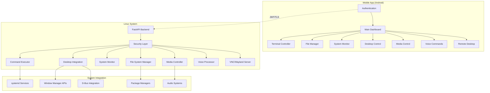

# Linux-Link Enhancement Design Document

## Overview

Linux-Link will be transformed into a comprehensive mobile remote control solution for Linux systems, specifically optimized for Arch Linux and modern window managers like Hyprland. The design focuses on deep system integration, security, and extensibility while maintaining the existing FastAPI backend architecture.

## Architecture

### High-Level Architecture



### Component Architecture

The system will be built using a modular architecture with the following core components:

1. **Enhanced Backend API** - Extended FastAPI server with new endpoints
2. **System Integration Layer** - Direct integration with Linux subsystems
3. **Security Framework** - Enhanced authentication and authorization
4. **Mobile Client** - Redesigned Android app with new features
5. **Plugin System** - Extensible architecture for custom integrations

## Components and Interfaces

### 1. Enhanced Backend API

**Core Modules:**
- `file_manager.py` - File operations and transfer handling
- `desktop_controller.py` - Window manager and desktop environment integration
- `media_controller.py` - Audio/video control and clipboard management
- `voice_processor.py` - Natural language command processing
- `remote_desktop.py` - VNC/Wayland screen sharing
- `automation_engine.py` - Macro and task automation
- `package_manager.py` - Arch Linux package management
- `notification_system.py` - Push notifications and alerts

**New API Endpoints:**
```python
# File Management
POST /files/browse          # Browse directory contents
POST /files/upload          # Upload files from mobile
GET  /files/download/{path} # Download files to mobile
POST /files/operations      # File operations (copy, move, delete)

# Desktop Control
GET  /desktop/workspaces    # List workspaces and windows
POST /desktop/workspace     # Switch workspace
POST /desktop/window        # Control window (move, resize, close)
POST /desktop/wallpaper     # Change wallpaper
GET  /desktop/notifications # Get system notifications

# Media Control
GET  /media/status          # Current media status
POST /media/control         # Play/pause/skip controls
POST /media/volume          # Volume control
GET  /clipboard             # Get clipboard content
POST /clipboard             # Set clipboard content

# Voice Commands
POST /voice/process         # Process voice command
GET  /voice/commands        # List available commands
POST /voice/custom          # Create custom command

# Remote Desktop
GET  /desktop/vnc           # Start VNC session
POST /desktop/input         # Send input events

# Automation
POST /automation/macro      # Create/execute macro
GET  /automation/tasks      # List scheduled tasks
POST /automation/schedule   # Schedule task

# Package Management
GET  /packages/installed    # List installed packages
POST /packages/search       # Search packages
POST /packages/install      # Install package
POST /packages/update       # Update system
```

### 2. System Integration Layer

**Window Manager Integration:**
```python
class WindowManagerAdapter:
    def __init__(self):
        self.wm_type = self.detect_window_manager()
        self.adapter = self.get_adapter()
    
    def detect_window_manager(self):
        # Detect Hyprland, i3, sway, GNOME, KDE, etc.
        pass
    
    def get_workspaces(self):
        # WM-specific workspace listing
        pass
    
    def switch_workspace(self, workspace_id):
        # WM-specific workspace switching
        pass
```

**D-Bus Integration:**
```python
class DBusController:
    def __init__(self):
        self.session_bus = dbus.SessionBus()
        self.system_bus = dbus.SystemBus()
    
    def get_notifications(self):
        # Access notification daemon
        pass
    
    def control_media(self, action):
        # Control media players via MPRIS
        pass
```

**Systemd Integration:**
```python
class SystemdManager:
    def list_services(self):
        # List all systemd services
        pass
    
    def control_service(self, service, action):
        # Start/stop/restart services
        pass
```

### 3. File System Manager

**Secure File Operations:**
```python
class SecureFileManager:
    def __init__(self, allowed_paths, user_context):
        self.allowed_paths = allowed_paths
        self.user_context = user_context
    
    def browse_directory(self, path):
        # Secure directory browsing with permission checks
        pass
    
    def upload_file(self, file_data, destination):
        # Secure file upload with validation
        pass
    
    def download_file(self, file_path):
        # Secure file download with streaming
        pass
```

### 4. Desktop Controller

**Hyprland Integration:**
```python
class HyprlandController:
    def __init__(self):
        self.socket_path = "/tmp/hypr/{}/hyprland.sock"
    
    def get_workspaces(self):
        # Query Hyprland workspaces via IPC
        pass
    
    def get_windows(self):
        # Get window information
        pass
    
    def execute_command(self, command):
        # Execute Hyprland commands
        pass
```

**i3/Sway Integration:**
```python
class I3SwayController:
    def __init__(self):
        self.connection = i3ipc.Connection()
    
    def get_workspaces(self):
        return self.connection.get_workspaces()
    
    def switch_workspace(self, name):
        self.connection.command(f'workspace {name}')
```

### 5. Media Controller

**MPRIS Integration:**
```python
class MediaController:
    def __init__(self):
        self.players = self.discover_players()
    
    def discover_players(self):
        # Discover MPRIS-compatible players
        pass
    
    def control_playback(self, player, action):
        # Control media playback
        pass
```

**Audio System Integration:**
```python
class AudioController:
    def __init__(self):
        self.audio_system = self.detect_audio_system()  # PulseAudio/PipeWire
    
    def set_volume(self, volume):
        # Set system volume
        pass
    
    def get_audio_devices(self):
        # List audio devices
        pass
```

### 6. Voice Processor

**Natural Language Processing:**
```python
class VoiceCommandProcessor:
    def __init__(self):
        self.commands = self.load_command_definitions()
    
    def process_command(self, text):
        # Parse natural language and execute commands
        pass
    
    def register_custom_command(self, trigger, actions):
        # Register user-defined commands
        pass
```

### 7. Remote Desktop

**VNC/Wayland Screen Sharing:**
```python
class RemoteDesktopServer:
    def __init__(self):
        self.display_server = self.detect_display_server()
    
    def start_vnc_server(self):
        # Start VNC server for X11
        pass
    
    def start_wayland_sharing(self):
        # Start Wayland screen sharing
        pass
    
    def process_input_event(self, event):
        # Process touch/mouse input from mobile
        pass
```

### 8. Package Manager Integration

**Arch Linux Package Management:**
```python
class ArchPackageManager:
    def __init__(self):
        self.pacman = "/usr/bin/pacman"
        self.aur_helper = self.detect_aur_helper()  # yay, paru, etc.
    
    def search_packages(self, query):
        # Search official repos and AUR
        pass
    
    def install_package(self, package):
        # Install package with progress tracking
        pass
    
    def update_system(self):
        # Perform system update
        pass
```

## Data Models

### Core Data Structures

```python
@dataclass
class FileItem:
    name: str
    path: str
    type: str  # file, directory, symlink
    size: int
    permissions: str
    modified: datetime
    owner: str

@dataclass
class Workspace:
    id: int
    name: str
    active: bool
    windows: List[Window]

@dataclass
class Window:
    id: int
    title: str
    class_name: str
    workspace: int
    geometry: Dict[str, int]
    focused: bool

@dataclass
class MediaStatus:
    player: str
    title: str
    artist: str
    status: str  # playing, paused, stopped
    position: int
    duration: int

@dataclass
class SystemService:
    name: str
    status: str  # active, inactive, failed
    enabled: bool
    description: str

@dataclass
class VoiceCommand:
    trigger: str
    actions: List[str]
    description: str
    custom: bool

@dataclass
class AutomationMacro:
    name: str
    commands: List[str]
    conditions: List[str]
    schedule: Optional[str]
```

## Error Handling

### Comprehensive Error Management

```python
class LinuxLinkException(Exception):
    def __init__(self, message, error_code, details=None):
        self.message = message
        self.error_code = error_code
        self.details = details or {}

class FileOperationError(LinuxLinkException):
    pass

class DesktopControlError(LinuxLinkException):
    pass

class MediaControlError(LinuxLinkException):
    pass

class VoiceProcessingError(LinuxLinkException):
    pass

# Error handling middleware
@app.exception_handler(LinuxLinkException)
async def handle_linux_link_error(request, exc):
    return JSONResponse(
        status_code=400,
        content={
            "error": exc.message,
            "code": exc.error_code,
            "details": exc.details
        }
    )
```

### Graceful Degradation

The system will implement graceful degradation for unsupported features:
- If window manager is not supported, disable desktop control features
- If audio system is not detected, disable media controls
- If VNC is not available, disable remote desktop
- If package manager is not found, disable package management

## Testing Strategy

### Unit Testing
- Test each component in isolation
- Mock system dependencies (D-Bus, systemd, etc.)
- Test error conditions and edge cases
- Validate security controls

### Integration Testing
- Test component interactions
- Validate API endpoints with real system calls
- Test file operations with actual filesystem
- Verify window manager integrations

### System Testing
- End-to-end testing on different Linux distributions
- Test with various window managers (Hyprland, i3, sway, GNOME, KDE)
- Performance testing under load
- Security penetration testing

### Mobile Testing
- Android app functionality testing
- Network connectivity testing
- UI/UX testing across different screen sizes
- Battery usage optimization testing

### Test Environment Setup
```bash
# Docker containers for different Linux environments
docker-compose -f test/docker-compose.test.yml up

# Automated testing pipeline
pytest tests/ --cov=backend-api --cov-report=html

# Integration tests
python -m pytest tests/integration/ -v

# Mobile app testing
./gradlew test
./gradlew connectedAndroidTest
```

This design provides a comprehensive foundation for transforming Linux-Link into a full-featured remote control solution for Linux systems, with particular focus on Arch Linux and modern window managers like Hyprland.