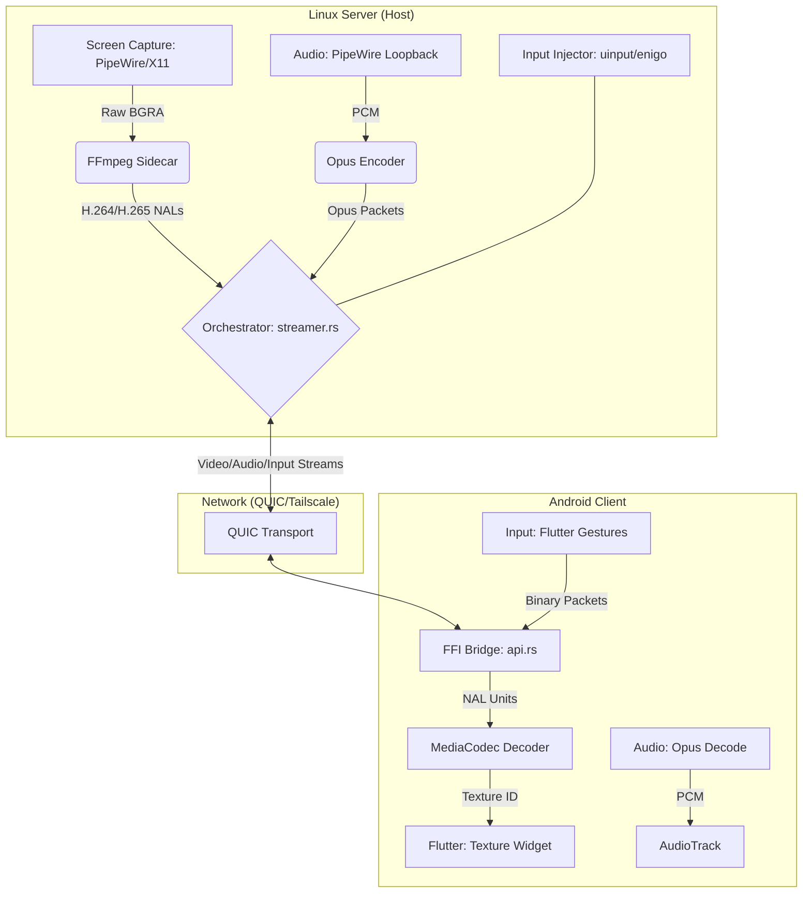

# Design Spec: High-Performance Screen Mirroring & RustDesk Benchmarking

**Date:** 2026-05-23  
**Status:** Draft / Pending Approval  
**Topic:** Screen Mirroring Optimization

## 1. Executive Summary
This spec outlines the optimization of the Linux Link screen mirroring pipeline based on a comparative analysis with RustDesk. The goal is to achieve sub-50ms latency for remote desktop use on Wayland and X11 while maintaining high visual fidelity and robust input injection.

## 2. Research & Benchmarking: Linux Link vs. RustDesk

### 2.1 Capture Method
| Feature | RustDesk (Linux) | Linux Link (Current) | Recommendation |
| :--- | :--- | :--- | :--- |
| **Wayland** | XDG Desktop Portal + PipeWire | XDG Desktop Portal + PipeWire | **Keep current.** PipeWire is the industry standard for secure, zero-copy capture on Wayland. |
| **X11** | Xlib/XCB (`XGetImage`) | `xcap` (XShm) | **Keep current.** `xcap` uses XShm which is comparable to RustDesk's performance. |
| **Multi-Monitor**| Native Portal/X11 | Manual Index Selection | **Optimize.** Unify monitor detection using `linux-link-core` metadata. |

### 2.2 Encoding Strategy
| Feature | RustDesk (Linux) | Linux Link (Current) | Recommendation |
| :--- | :--- | :--- | :--- |
| **Backend** | Custom FFmpeg/Vulkan | FFmpeg Sidecar (Process) | **Enhance sidecar.** Processes are easier to manage and debug than linked libraries. |
| **Hardware Accel**| VAAPI, NVENC, Vulkan | VAAPI, NVENC (Probed) | **Expand.** Add HEVC (H.265) support for 50% bandwidth savings. |
| **Bitrate** | Adaptive (Loss-based) | Adaptive (RTT-based) | **Hybrid.** Use both RTT and packet loss for smoother transitions. |

### 2.3 Transport Layer
| Feature | RustDesk | Linux Link | Recommendation |
| :--- | :--- | :--- | :--- |
| **Protocol** | TCP / RDP-over-UDP | QUIC (quinn) | **Keep QUIC.** QUIC provides the reliability of TCP with the low latency of UDP, plus native encryption. |

---

## 3. Proposed Architecture (Wiring Diagram)



---

## 4. Key Improvements & Wiring Changes

### 4.1 Hybrid Adaptive Bitrate (ABR)
- **Problem:** Current ABR only looks at RTT.
- **Solution:** Update `core/src/streaming/bitrate.rs` to consume both RTT and `lost_packets` from `quinn` stats. 
- **Wiring:** Pass `lost_packets` from `StreamingClient` (Android) back to `StreamingServer` via the existing stats stream.

### 4.2 Unified Monitor Management
- **Problem:** Monitoring index is manually passed and sometimes hardcoded.
- **Solution:** Expose a `list_monitors()` FFI that returns name, resolution, and index.
- **Wiring:** Flutter calls `list_monitors()` → Rust probes via `xcap` or `ashpd` → User selects → Index stored in `monitorIndexProvider`.

### 4.3 Input Injection Unification
- **Problem:** Two separate paths for input (KDE Connect TCP vs QUIC Stream).
- **Solution:** Deprecate the KDE Connect `InputPlugin` for active streaming sessions.
- **Wiring:** When `isStreamingProvider` is true, all input goes via QUIC binary `InputPacket` for sub-10ms response.

---

## 5. Agent Instructions (JSON Schema Update)
To ensure agents (like me) understand this architecture, we will update the `GEMINI.md` (or equivalent) with this context:

```json
{
  "project_context": {
    "subsystems": {
      "streaming": {
        "capture": "PipeWire (Wayland) / XShm (X11)",
        "encoding": "FFmpeg Sidecar (Annex B H.264/H.265)",
        "transport": "QUIC (quinn) over Port 4716",
        "input": "uinput (Kernel) fallback to enigo (X11)"
      }
    },
    "critical_files": [
      "core/src/streaming/streamer.rs",
      "server/src/input_injector.rs",
      "android/rust/src/api.rs"
    ]
  }
}
```

## 6. Verification Plan
1. **Latency Test:** Measure time from `InputPacket` sent to `FrameDto` received. Target: <100ms on LAN.
2. **Codec Test:** Toggle H.264 vs H.265 in Settings and verify `MediaCodec` initialization.
3. **Safety Test:** Ensure `uinput` backend does not leak file descriptors.
